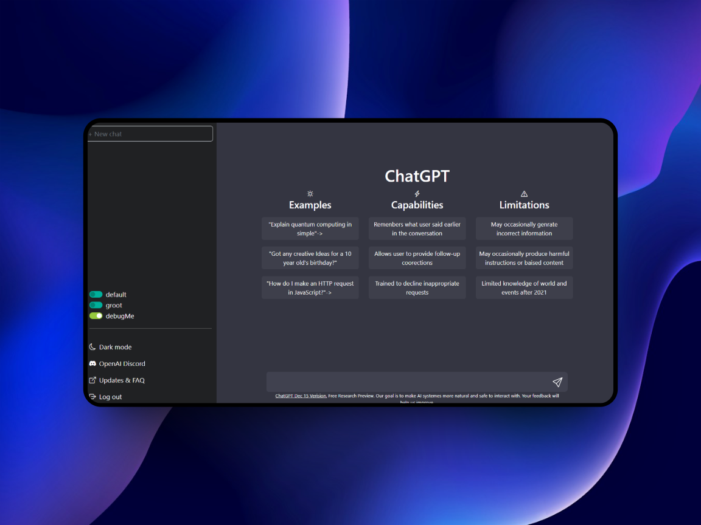
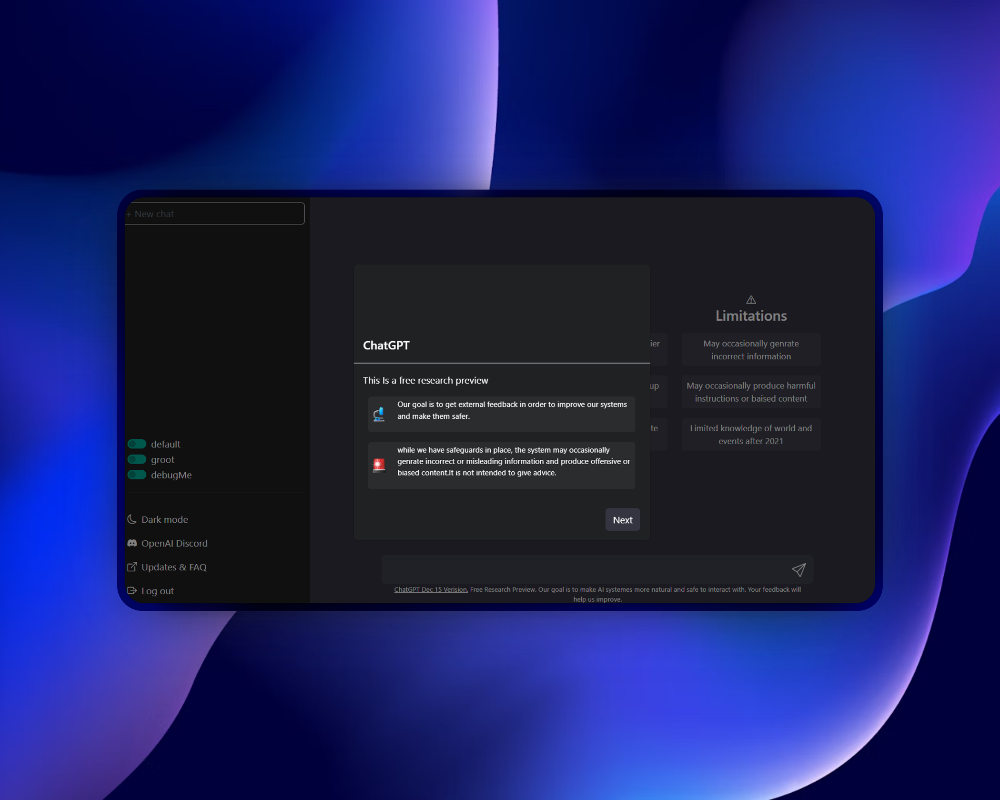

<div align="center">

# 💬 Mini Chat avec l'API ChatGPT - HTML / CSS / JS 🤖

### 🛠️ Développé en **JavaScript Vanilla**, **HTML**, **CSS**  
### ⚡ Connecté à l'**API de ChatGPT** via `fetch`

---

### 💼 Mission du projet

🖊️ Cher curieux du code,  

Bienvenue dans ce projet de **chat interactif** basé sur l’API d’OpenAI (ChatGPT).  
Tu es ici face à une interface simple, épurée, mais **intelligente** 🤓.

🎯 L’objectif ?  
👉 Mettre en place une **application web légère** capable de communiquer avec ChatGPT via requêtes HTTP.  
Aucune librairie externe, aucun framework – juste du **JavaScript pur**, du **HTML** et du **style CSS propre**.

<br>




</div>

---

## 🚀 Fonctionnalités

- 💬 Interface de chat dynamique
- ⚡ Intégration de l’API OpenAI GPT
- 🔁 Requêtes `fetch` pour communiquer avec le modèle
- 🎨 Design responsive et minimaliste
- 🧠 Réponses automatiques générées par l'IA
- 🧪 Parfait pour comprendre les bases de l’API ChatGPT

---

## 📦 Installation

```bash
git clone https://github.com/TonPseudo/Projet_chat_gpt_JS.git
cd Projet_chat_gpt_JS
```

> 🔐 Assure-toi d’avoir une **clé API OpenAI** et de l’ajouter dans le fichier JavaScript (`main.js` ou autre selon ton code).

---

## 🔑 Ajout de la clé API

Dans ton fichier JS (ex : `script.js`), insère ta clé comme ceci :

```js
const API_KEY = "ta-clé-ici";
```

Tu peux aussi stocker cette clé dans un fichier `.env` côté backend si tu veux aller plus loin en sécurité (dans une version Node par ex).

---

## 🖼️ Structure du projet

```bash
├── index.html
├── script.js
├── style.css
└── assets/
    └── images, icônes...
```

---

## 🙌 Remerciements

Merci d’avoir exploré ce projet !  
C’est un exemple parfait pour apprendre à **utiliser une API externe** dans un environnement **JavaScript natif**.

<div align="center">
⭐ Un petit like ou une contribution est toujours la bienvenue ! ⭐  
</div>
